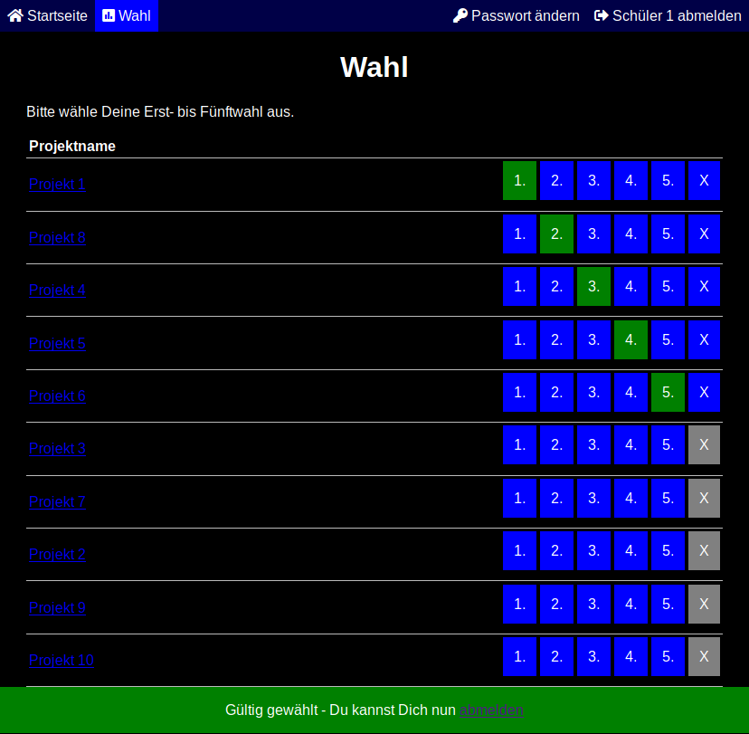
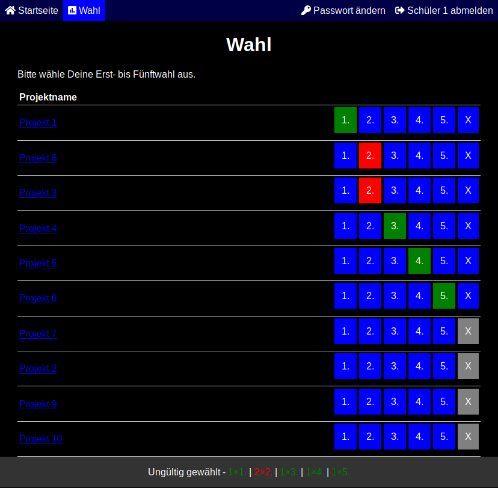
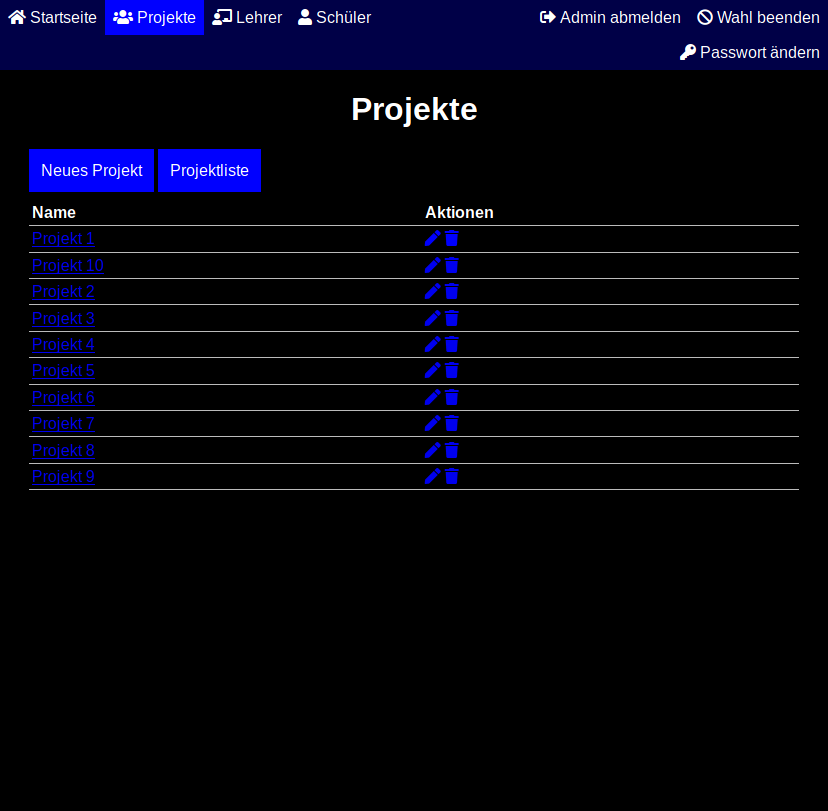
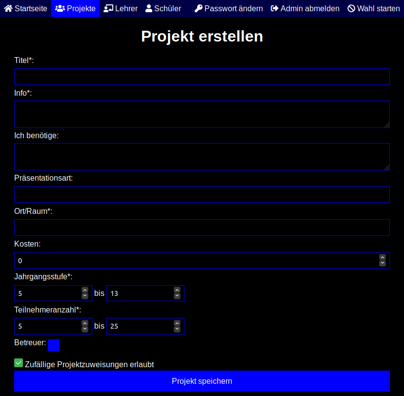
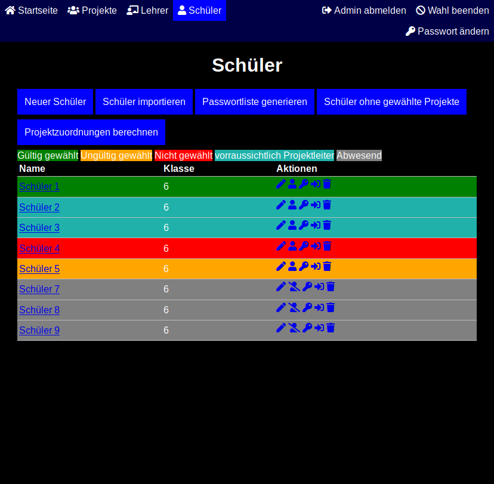
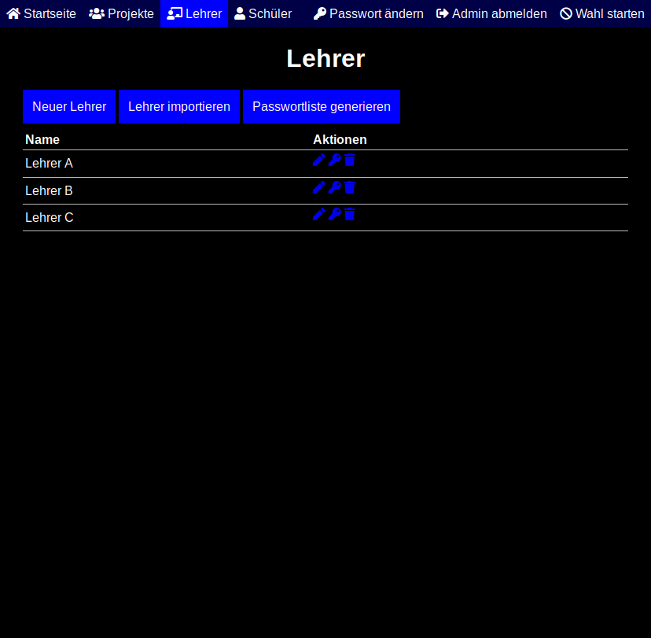
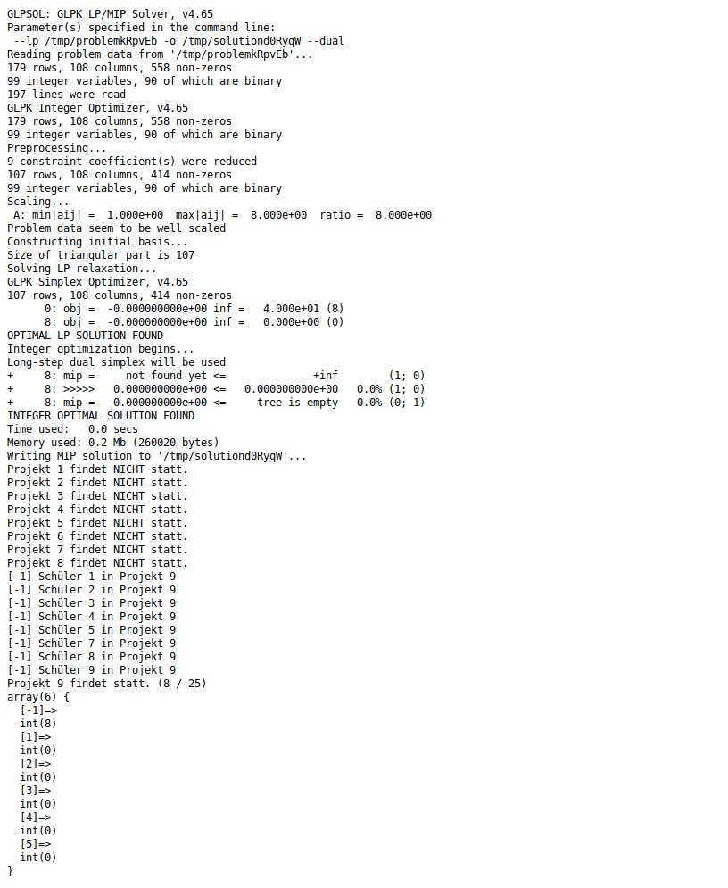

<!--
SPDX-FileCopyrightText: 2020 Moritz Hedtke <Moritz.Hedtke@t-online.de>
SPDX-License-Identifier: AGPL-3.0-or-later

Diese Software kann eine Projektwahl verwalten, wie sie beispielsweise für eine Projektwoche benötigt wird. 
Copyright (C) 2020 Moritz Hedtke <Moritz.Hedtke@t-online.de>

This program is free software: you can redistribute it and/or modify
it under the terms of the GNU Affero General Public License as published
by the Free Software Foundation, either version 3 of the License, or
(at your option) any later version.

This program is distributed in the hope that it will be useful,
but WITHOUT ANY WARRANTY; without even the implied warranty of
MERCHANTABILITY or FITNESS FOR A PARTICULAR PURPOSE.  See the
GNU Affero General Public License for more details.

You should have received a copy of the GNU Affero General Public License
along with this program.  If not, see <https://www.gnu.org/licenses/>.
-->
# Projektwoche-Software

Diese Software hilft beim Vorbereiten einer Projektwoche oder ähnlichen Veranstaltungen, bei denen Personen anhand von Wahlen in Projekte zugeordnet werden müssen. Dies passiert hier jedoch komplett automatisch und gerecht.

## Features

* Intuitive Bedienung und Hilfe
* Konfigurierbarer Willkommenstext (TODO)
* Schüler
  * CSV Import möglich
  * von Lehrer als abwesend setzbar
  * einfach anmelden und wählen
  * für Lehrer sichtbar, wer noch nicht gewählt hat
  * ausdruckbare Passwortlisten
  * Passwörter sicher gespeichert (bcrypt)
  * Passwort änderbar
* Projekte
  * vorraussichtliche Größe / Existenz für Lehrer sichtbar (TODO)
  * Betreuer (Lehrer)
  * *Schülerleiter*
  * Kosten
  * ausdruckbar
* Wahl
  * Projekte in Erst- bis Fünftwahl einteilen
  * Jederzeit beendbar und startbar
  * Automatische Berechnung der Projektzuordungen
    * auch manuelle Änderungen möglich
    * Wahlzeitpunkt irrelevant
    * Maximierung der kollektiven Zufriedenheit
    * mathematisch beweisbarer optimaler Algorithmus
    * ausdruckbar
* Lehrer
  * CSV Import möglich
  * kann Projekte erstellen
  * ausdruckbare Passwortlisten
  * Passwörter sicher gespeichert (bcrypt)
  * kann Schülerpasswörter zurücksetzen
  * Passwort änderbar
* Administrator
  * kann Schüler- und Lehrerpasswörter zurücksetzen
  * Passwort änderbar

## Kosten

### Kostenlos

* Quellcode öffentlich
* Selbständige Einrichtung
* Kein Support
* [https://github.com/mohe2015/projektwahl-php](https://github.com/mohe2015/projektwahl-php)

### Standard

* Quellcode öffentlich
* Komplettes Management
* Support
* Persönliche Modifikationen (Extrakosten möglich)
* Kontakt: [Moritz.Hedtke@t-online.de](mailto:Moritz.Hedtke@t-online.de)

## Screenshots

